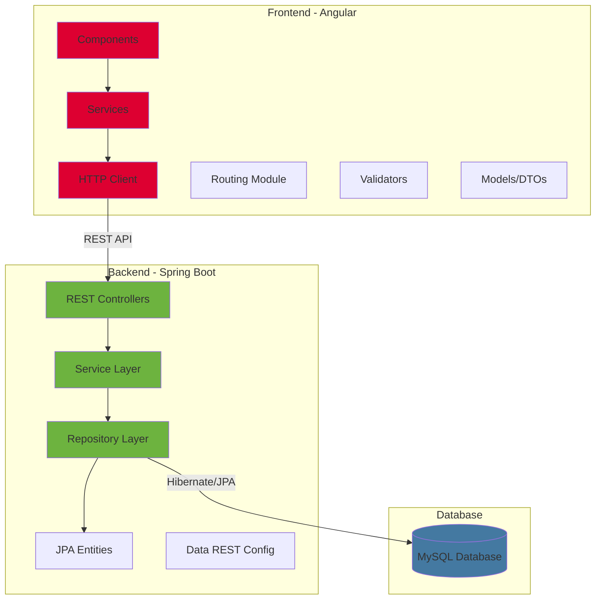

# Ecommerce Fullstack

A full stack e-commerce web application with Angular and Spring Boot, featuring product browsing, shopping cart functionality, and checkout capabilities.

## Overview

This project is a sample e-commerce website that demonstrates modern full-stack development practices. It consists of an Angular-based front-end written in TypeScript and a Spring Boot back-end written in Java, connected through RESTful APIs. The application allows users to browse products by category, search for items, manage a shopping cart, and complete purchases with address validation.

## Motivation

This project was created to demonstrate proficiency in full-stack web development, showcasing the integration of a modern JavaScript framework with a robust Java back-end. It serves as a practical example of building scalable e-commerce solutions with industry-standard technologies and best practices.

## Tech Stack

### Frontend

- **Angular** - TypeScript-based web application framework
- **ng-bootstrap** - Bootstrap components for angular
- **TypeScript** - Type-safe JavaScript
- **HTML/CSS** - UI markup and styling

### Backend

- **Spring Boot** - Java-based application framework
- **Spring Data REST** - RESTful API creation
- **Spring Data JPA** - Database access layer
- **Hibernate** - ORM framework
- **MySQL** - Relational database
- **Maven** - Dependency management and build tool

## Features

- **Product Catalog** - Browse products organized by categories (books, coffee mugs, luggage tags, mouse pads)
- **Product Search** - Search functionality to find specific products
- **Product Details** - View detailed information about individual products
- **Shopping Cart** - Add, remove, and update product quantities in cart
- **Cart Status** - Real-time cart summary with item count and total price
- **Checkout Process** - Complete purchase with customer information and shipping address
- **Address Validation** - Country and state selection with form validation
- **Responsive Design** - Mobile-friendly user interface

## Architecture



## Running locally

### Prerequisites

- Node.js v18+
- Java 17+
- Maven
- MySQL Server

### Database Setup

1. Create a MySQL database named `full-stack-ecommerce`
2. Update database credentials in [application.properties](spring-boot-ecommerce/src/main/resources/application.properties)

### Backend Setup (Windows)

1. Navigate to Spring Boot directory in a new terminal:

```bash
  cd spring-boot-ecommerce
```

2. Build the project

```bash
  .\mvnw clean install
```

3. Run the project:

```bash
  .\mvnw spring-boot:run
```

This should start the server running on localhost:8080

### Frontend Setup

1. Navigate to Angular directory in a new terminal:

```bash
  cd angular-ecommerce
```

2. Install dependencies:

```bash
  npm install
```

3. Start the development server:

```bash
  ng serve
```

The frontend will start on localhost:4200

### Access the application

Open your browser and navigate to [localhost:4200](http://localhost:4200)
